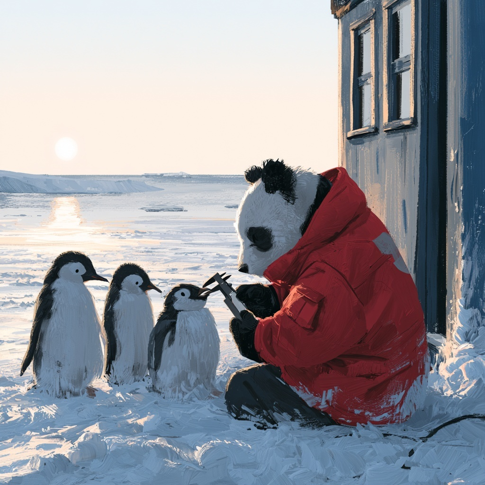

::: {style="width: 80%; margin: auto;"}

:::

:::{.gray-text .center-text}
*A panda, measuring three different penguins.* [MidJourney 5](https://www.midjourney.com/jobs/b64dc6b3-2e5a-49d0-8dd4-f9b8a8f49145?index=0)

:::

Between 2007 and 2009, researchers at the Palmer Station on the Antarctic Peninsula measured 344
penguins of three species: Adélie, Chinstrap and Gentoo. For each bird they recorded four numbers,
the island it was caught on, and its biological sex.

The resulting file is small, and relatively clean by the standards of anything you have opened this week. It also
holds a relationship between two of the bill measurements that runs one way within each species and the other way
across all three at once, and a table of means of those same columns points at the wrong one of
those two directions.

This afternoon we will build the figure that separates them, one plot at a time, using the plotting patterns from
this morning.

Work in **pairs**, in one shared notebook, taking turns at the keyboard. Swap every time you
finish a numbered task. The person not typing should read through the output (quietly) and explain what the code should produce/calculate before you run it. 

We have about 45 minutes for this activity: roughly 40 on the four parts below, and the rest on setting up and on
the wrap-up. The times in the headings are rough guides, so please let Cella or Kelly know if you and your partner are
getting stuck on any of the tasks!

## The patterns you need

Every plotting pattern we need this afternoon comes from this morning's session.

```python
sns.scatterplot(data=df, x='col', y='col')             # one measurement against another
sns.histplot(data=df, x='col')                         # the distribution of one column
sns.barplot(x=series.values, y=series.index)           # a grouped Series, as bars

hue='col'                                              # works on all three
```

In addition, we will need to work with the matplotlib figure frame:

```python
plt.figure(figsize=(w, h))
plt.xlabel(...) ; plt.ylabel(...) ; plt.title(...)
plt.tight_layout()
```

Finally, we will also need these cleaning, grouping, selection, and sorting patterns, all from earlier in the week:

```python
df.dropna()
df.groupby('key')['column'].agg(['count', 'mean'])
df['column'].value_counts()
df.sort_values('column', ascending=False)
```

## Setup

Create a notebook named `Colab_7C_Penguins.ipynb`, with both partners' names in the title cell,
then read the file:

```{python}
#| echo: true
#| include: true

import pandas as pd
import matplotlib.pyplot as plt
import seaborn as sns

url = 'https://eds-217-essential-python.github.io/data/penguins.csv'
penguins = pd.read_csv(url)
```

## Part 1: What is in the file (about 8 minutes)

Answer each question with code, then write the answer in a markdown cell underneath, in a complete
sentence with the numbers in it.

1. How many rows and columns? What are the column names, and which are numeric?

```{python}
print(penguins.shape)
print(penguins.dtypes)
```

2. Count the rows for each `species`, and separately for each `island`. Which species is rarest,
   and which island has the most birds?

```{python}
print(penguins['species'].value_counts())
print(penguins['island'].value_counts())
```

3. Run `.isnull().sum()`. Two different things are going on in that output. Say what each one
   probably is.

```{python}
penguins.isnull().sum()
```

4. Build a clean table called `birds` by dropping every row with any missing value, and report how
   many rows you lost. Then re-run the species counts on `birds` and say whether the losses fell
   evenly across the three species.

```{python}
birds = penguins.dropna().copy()

print(penguins.shape, birds.shape)
print(birds['species'].value_counts())
```

## Part 2: Distributions (about 8 minutes)

5. Draw a histogram of `flipper_length_mm` for the whole table. Label the x-axis with units and
   give the figure a title. Describe the shape in one sentence.

```{python}
plt.figure(figsize=(7, 5))
sns.histplot(data=birds, x='flipper_length_mm')
plt.xlabel('Flipper length (mm)')
plt.title('Flipper length, all penguins')
plt.show()
```

6. Draw it again, split by `species`. In a markdown cell, say what the two humps in question 5
   turned out to be, and whether "the average penguin has a flipper of about 201 mm" is a useful
   sentence.

```{python}
plt.figure(figsize=(7, 5))
sns.histplot(data=birds, x='flipper_length_mm', hue='species')
plt.xlabel('Flipper length (mm)')
plt.title('Flipper length by species')
plt.show()
```

7. Pick one of `bill_length_mm`, `bill_depth_mm` or `body_mass_g` and do the same pair of figures
   for it. Does that measurement separate the species as cleanly as flipper length does?

```{python}
plt.figure(figsize=(7, 5))
sns.histplot(data=birds, x='body_mass_g', hue='species')
plt.xlabel('Body mass (g)')
plt.title('Body mass by species')
plt.show()
```

## Part 3: Relationships (about 15 minutes)

Part 3 is where the afternoon's result shows up, so please work through it in order, and do not skip question 9!

8. Draw a scatter plot of `body_mass_g` against `flipper_length_mm`, with flipper length across
   the bottom. Label both axes and title it. Describe the relationship in one sentence.

```{python}
plt.figure(figsize=(7, 5))
sns.scatterplot(data=birds, x='flipper_length_mm', y='body_mass_g')
plt.xlabel('Flipper length (mm)')
plt.ylabel('Body mass (g)')
plt.title('Body mass against flipper length')
plt.show()
```

9. Draw the same figure with `hue='species'`. Does adding the species change what you would say
   about the relationship, or just make it prettier? One sentence.

```{python}
plt.figure(figsize=(7, 5))
sns.scatterplot(data=birds, x='flipper_length_mm', y='body_mass_g', hue='species')
plt.xlabel('Flipper length (mm)')
plt.ylabel('Body mass (g)')
plt.title('Body mass against flipper length, by species')
plt.show()
```

10. Now a different pair of columns. Draw a scatter plot of `bill_depth_mm` against
    `bill_length_mm`, with bill length across the bottom, and **no** `hue=`. Label it.

    Before you go on, write down in a markdown cell what this figure says: as a penguin's bill
    gets longer, does it get deeper or shallower?

```{python}
plt.figure(figsize=(7, 5))
sns.scatterplot(data=birds, x='bill_length_mm', y='bill_depth_mm')
plt.xlabel('Bill length (mm)')
plt.ylabel('Bill depth (mm)')
plt.title('Bill depth against bill length')
plt.show()
```

11. Draw it once more with `hue='species'`.

```{python}
plt.figure(figsize=(7, 5))
sns.scatterplot(data=birds, x='bill_length_mm', y='bill_depth_mm', hue='species')
plt.xlabel('Bill length (mm)')
plt.ylabel('Bill depth (mm)')
plt.title('Bill depth against bill length, by species')
plt.show()
```

12. Read your answer to question 10 back, and then look at question 11. **Within** each of the three
    species, longer bills go with **deeper** bills. **Across all three together**, longer bills go with
    **shallower** ones.

    In a markdown cell of four or five sentences: explain how both of those can be true at once.
    Your explanation should mention where the three species sit relative to each other, and it
    should not use the word "wrong" about either figure.

:::{.callout-important title="This has a name"}
A relationship that runs one way inside every group and the other way across the pooled data is
called **Simpson's paradox**. It is one of the most common ways that a perfectly correct summary of
a dataset can produce a conclusion that is the reverse of the truth. 
It can show up whenever the groups differ both in what you are measuring and in how many of them
there are.

One argument, `hue='species'`, is what makes it visible here. Without the figure, you would have had
to suspect the pattern before you could go looking for it!
:::

## Part 4: Summaries, and what they hide (about 10 minutes)

13. Build a Series of mean `body_mass_g` by species, sorted from heaviest to lightest, and draw it
    as **horizontal** bars using the `.values` and `.index` idiom. Label both axes and title it.

```{python}
mean_mass = birds.groupby('species')['body_mass_g'].mean().sort_values(ascending=False)

plt.figure(figsize=(7, 4))
sns.barplot(x=mean_mass.values, y=mean_mass.index)
plt.xlabel('Mean body mass (g)')
plt.ylabel('Species')
plt.title('Mean body mass by species')
plt.show()
```

14. Two of those three bars are nearly the same height. Look back at your figure from question 11.
    In one sentence: would you say those two species are similar birds?

15. Run `.agg(['count', 'mean'])` on the same grouping and print it. Then build a Series of the
    number of birds on each island with `.value_counts()`, and draw **that** as horizontal bars
    too.

```{python}
print(birds.groupby('species')['body_mass_g'].agg(['count', 'mean']).round(1))

island_counts = birds['island'].value_counts()

plt.figure(figsize=(7, 4))
sns.barplot(x=island_counts.values, y=island_counts.index)
plt.xlabel('Number of penguins')
plt.ylabel('Island')
plt.title('Sampling effort by island')
plt.show()
```

16. Draw a bar chart of mean `body_mass_g` by species, split by sex. The `data=` form is easier
    here, because you want two bars per species:
    `sns.barplot(data=birds, x='species', y='body_mass_g', hue='sex')`.

    Then report in one sentence what the sex split adds to your answer to question 14.

```{python}
plt.figure(figsize=(7, 5))
sns.barplot(data=birds, x='species', y='body_mass_g', hue='sex')
plt.xlabel('Species')
plt.ylabel('Mean body mass (g)')
plt.title('Mean body mass by species and sex')
plt.show()
```

17. This is the last task, and it is a bit of a trap (sorry!). Build a wide table with `species` down the rows,
    `island` across the columns, and a **count** of `body_mass_g` in the cells. You built the
    pivot pattern yesterday morning; add `aggfunc='count'` to it.

    In a markdown cell, using two or three sentences answer the following: given that table, what might go wrong if somebody used this dataset to compare Biscoe island with Dream island?

```{python}
birds.pivot_table(index='species', columns='island', values='body_mass_g', aggfunc='count')
```

## Before you stop

Check that:

- every figure you made has an x-label, a y-label and a title, and the labels give units
- you can say out loud what `hue=` did in each of the three kinds of plot we used it in
- your answer to question 12 does not describe either figure as incorrect
- your notebook reads top to bottom as a document, not as a mishmash of cells

## Resources

- [📖 EDS 217 cheatsheet: seaborn](../cheatsheets/seaborn.qmd)
- [📖 EDS 217 cheatsheet: bar plots](../cheatsheets/bar_plots.qmd)
- [📖 EDS 217 cheatsheet: grouping and aggregating](../cheatsheets/data_grouping.qmd)
- [Palmer Penguins](https://allisonhorst.github.io/palmerpenguins/){target="_blank"}
- [Gorman KB, Williams TD, Fraser WR (2014), the paper the data comes from](https://doi.org/10.1371/journal.pone.0090081){target="_blank"}
