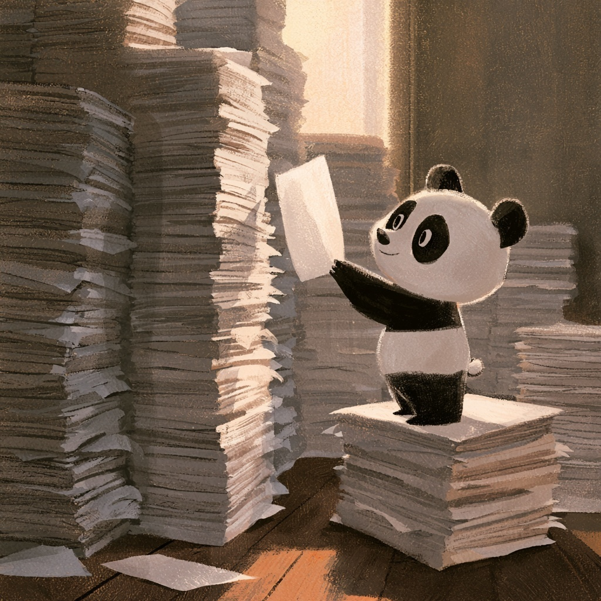

::: {style="width: 80%; margin: auto;"}

:::

:::{.gray-text .center-text}
*A panda, comparing two stacks of the same thing.* [MidJourney 5](https://www.midjourney.com/jobs/2ec239b4-9d83-416b-b2c3-bff7744cad1d?index=0)

:::

For five days every question we've asked was a question about one table. We got away with it
because somebody (your kind and generous instructional team) had already put everything you needed in one place.

Suffice to say, that is not how data usually arrives. Instead it shows up on your doorstep as a grab bag of files that describe the same thing from different angles, or as thirty files that describe different things in the same format, or as one
file laid out at right angles to the question you want to ask. Before you can analyse any of that,
you have to change its shape.

Today we will learn the three steps that take a **big 'ol bag-o-data (tm)** and turn it into a **dataframe you can actually use**. One step puts two tables **side by side**. One step stacks
many tables **top to bottom**. One step takes a single table and **rotates** it. None of them actually calculates
anything! However, without them most of what you learned last week cannot be applied to real files.

This afternoon you meet the column that is hardest to get into the right shape, get a little deeper into the weeds about the python everything-is-an-object paradigm, and meet your new best frenemy: `datetime`.

## Class materials

|  Session  |  Session 1  |   Session 2 |
|-------------------|-----------------------------------------------------------------------------------------------------------------------------------------------------|----------------------------------------------------------------------------------|
| day 6 / morning   | [🔗 The Join Pattern](interactive-sessions/6a_joining_data.qmd) | [🧩 Long and Wide](interactive-sessions/6b_reshaping_data.qmd) |
| day 6 / afternoon | [📆 A Date Is Not a Number](interactive-sessions/6c_dates.qmd) | [🙌 Two Records, Sixty-Six Years Apart](coding-colabs/6d_two_table_exercise.qmd) |
: {.hover .bordered tbl-colwidths="[20,40,40]"}

## End-of-day practice

Our final activity today delves into the highs and lows (pitches, natch) of sixty-four years of the Eurovision Song Contest. We will put the day's three reshaping moves to work on it, and find a number of reasons to be wary of easy answers.

- [ **Day 6 Practice:** 🕺 Sixty-Four Contests, Two Tables 💃](eod-practice/eod-day6-2026.qmd)

<!-- Answer keys are held back so that the room tries, gets stuck and asks.
     Kelly posts these URLs in Slack or on the whiteboard once a session has
     run. Uncomment this section after the course to restore the links. -->
<!-- ## Answer keys -->

<!-- Work the exercise first, then check it. The keys show the code, and more usefully the -->
<!-- written answers, which are the half you cannot check on your own. -->

<!-- - [ **Colab 6d key:** 🌍 Two Records, Sixty-Six Years Apart](answer-keys/6d_two_table_exercise-key.qmd) -->
<!-- - [ **Day 6 practice key:** 🕺 Sixty-Four Contests, Two Tables 💃](answer-keys/eod-day6-2026-key.qmd) -->

## Additional Resources

- [ The Data Science Workflow](the-data-science-workflow.qmd)
- [ merging and joining cheatsheet](cheatsheets/data_merging.qmd)
- [ working with timeseries cheatsheet](cheatsheets/timeseries.qmd)
- [ grouping and aggregating cheatsheet](cheatsheets/data_grouping.qmd)
- [ pandas DataFrames cheatsheet](cheatsheets/pandas_dataframes.qmd)
