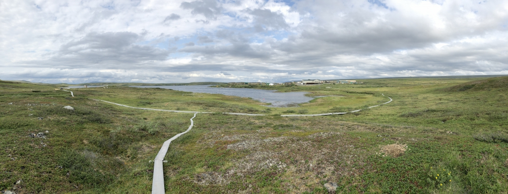

::: {style="width: 80%; margin: auto;"}

:::

:::{.gray-text .center-text}
*The boardwalk at Toolik Field Station, Alaska.* [Arcus](https://media.arcus.org)

:::

This afternoon we ran the complete workflow together in sessions 1c and 1d. Tonight you will run
the whole thing again on your own, changing a few things along the way to see what happens.

#### 🎬 "Coming Attractions"

- **Your job:** copy the given code, run it, and make the one change each task asks for.
- **Our job:** show you what a workflow looks like before you learn how every piece works.
- **The goal:** get comfortable running and modifying a real analysis.

:::{.callout-important title="Don't panic 🚀"}
You are not expected to understand every line today! You already used all of these tools this
afternoon, though only at a shallow level, and over the next six days we will cover each one
properly. If a cell refuses to run and you cannot work out why, grab Cella or Kelly and show
them what you saw.
:::

## The data

You will use the same Arctic weather data from the [Arctic LTER](https://lternet.edu/site/arctic-lter/)
station at Toolik Lake, Alaska: daily measurements from 1988 onward. The file lives in our
course repository, so you can load it straight from its URL.

## When you'll learn these skills

Everything in this workflow gets a full teaching day later in the course:

| What you use today | When you'll learn it | Workflow step |
|--------------------|----------------------|---------------|
| `pd.read_csv()`, `.head()`, `.info()` | **Day 2** | Import + Explore |
| `df[df['col'] > value]`, `.sort_values()` | **Day 3** | Filter + Sort |
| `.dropna()`, new columns | **Day 4** | Clean + Transform |
| `df.groupby(...)['col'].mean()` | **Day 5** | Group + Aggregate |
| `pd.merge()`, `pivot_table()` | **Day 6** | Join + Reshape + Dates |
| `plt.plot()`, `plt.bar()` | **Day 7** | Visualize |

## Setup

1. Create a new notebook named `EOD_Day1_Workflow.ipynb`.

2. Add a title cell:

```markdown
# Day 1 EOD: Rerun the Workflow

Date: 08/31/2026
```

3. Work through the rest of this page in your new notebook. Copy each code cell, run it, then
   write a short markdown note under it saying what you saw.

## Rebuild the workflow

Rebuild the analysis from this afternoon's sessions. Copy and run each cell.

### 1. Import and load

**Copy and run this code:**

```python
import pandas as pd
import matplotlib.pyplot as plt

url = "https://eds-217-essential-python.github.io/data/toolik_weather.csv"
df = pd.read_csv(url)
```

```{python}
import pandas as pd
import matplotlib.pyplot as plt

url = "https://eds-217-essential-python.github.io/data/toolik_weather.csv"
df = pd.read_csv(url)
```

:::{.callout-tip title="R vs Python: loading data"}
In R you would write `df <- read.csv(url)`. Python's `pd.read_csv(url)` does the same job,
reading a CSV straight from a URL into a DataFrame.
:::

### 2. Look at the data

**Copy and run this code:**

```python
df.head()
df.isnull().sum()
```

```{python}
df.head()
df.isnull().sum()
```

The `df.isnull().sum()` line is the **health check** you met this afternoon. It counts missing
values in each column. `Daily_AirTemp_Mean_C` has none, so the temperature analysis below needs
no cleaning.

### 3. Monthly average temperature

**Copy and run this code:**

```python
monthly = df.groupby('Month')
monthly_means = monthly['Daily_AirTemp_Mean_C'].mean()
monthly_means
```

```{python}
monthly = df.groupby('Month')
monthly_means = monthly['Daily_AirTemp_Mean_C'].mean()
monthly_means
```

:::{.callout-tip title="R vs Python: grouping"}
In dplyr you would write `df %>% group_by(Month) %>% summarize(mean(...))`, and grouping in
pandas does the same job. The two-step form `df.groupby('Month')` then `['col'].mean()` splits
the rows into monthly groups and averages one column within each.
:::

### 4. Plot it

**Copy and run this code:**

```python
plt.plot(monthly_means)
plt.title("Toolik Monthly Temperatures")
plt.xlabel("Month")
plt.ylabel("Temperature (°C)")
plt.show()
```

```{python}
plt.plot(monthly_means)
plt.title("Toolik Monthly Temperatures")
plt.xlabel("Month")
plt.ylabel("Temperature (°C)")
plt.show()
```

:::{.callout-tip title="R vs Python: plotting"}
In R you might draw this with `ggplot(...) + geom_line()`. Here `plt.plot(series)` takes your
twelve monthly values and draws them in order, and the label lines set the title and axes.
:::

You now have `df`, `monthly`, and `monthly_means` in your notebook, which is exactly where we
ended up this afternoon. Each of the three tasks below makes one change to this workflow.

## 🔁 Task 1: monthly means for a different variable

The rebuild averaged `Daily_AirTemp_Mean_C`. Keep the same grouping and average a **different
column** instead.

**What you wrote in the rebuild:**

```python
monthly_means = monthly['Daily_AirTemp_Mean_C'].mean()
```

**Your change:** swap the column for **one** from this menu, and store the result in a new
variable so `monthly_means` stays put:

- `Daily_globalrad_total_jcm2` (daily global radiation)
- `Daily_Precip_Total_mm` (daily precipitation)
- `Daily_windsp_mean_msec` (daily mean wind speed)

For example, `monthly_radiation = monthly['Daily_globalrad_total_jcm2'].mean()`. The new line
reads `monthly`, which was built from `df`, so it leaves both `df` and your `monthly_means`
unchanged.

```{python}
#| echo: false
#| include: false
monthly_radiation = monthly['Daily_globalrad_total_jcm2'].mean()
monthly_radiation
```

:::{.callout-important title="✍️ Required: say it in a sentence"}
Read one month's value from your new result and report it in an f-string. For example, after
reading June's value:

```python
june_radiation = 2041.9      # June's value, read from your output
print(f"At Toolik, June's average daily global radiation was {june_radiation} J/cm2.")
```
:::

```{python}
#| echo: false
#| include: false
june_radiation = 2041.9
print(f"At Toolik, June's average daily global radiation was {june_radiation} J/cm2.")
```

## 🔁 Task 2: yearly means

The rebuild grouped by `Month`. Now change the **grouping key** to `Year` to see the
year-by-year trend across the whole record.

**What you wrote in the rebuild:**

```python
monthly = df.groupby('Month')
monthly_means = monthly['Daily_AirTemp_Mean_C'].mean()
```

**Your change:** group by a different key. Build a new grouping and average the same
temperature column into new variables:

```python
by_year = df.groupby('Year')
yearly_means = by_year['Daily_AirTemp_Mean_C'].mean()
yearly_means
```

The new grouping reads `df` without changing it, and it leaves `monthly` and `monthly_means`
alone.

```{python}
#| echo: false
#| include: false
by_year = df.groupby('Year')
yearly_means = by_year['Daily_AirTemp_Mean_C'].mean()
yearly_means
```

:::{.callout-important title="✍️ Required: say it in a sentence"}
Read one year's value from `yearly_means` and report it in an f-string. For example, after
reading the value for the year 2000:

```python
temp_2000 = -8.97      # the year 2000 value, read from your output
print(f"In 2000, Toolik's average temperature was {temp_2000} degrees Celsius.")
```
:::

```{python}
#| echo: false
#| include: false
temp_2000 = -8.97
print(f"In 2000, Toolik's average temperature was {temp_2000} degrees Celsius.")
```

## 🔁 Task 3: a labeled bar chart

Draw the monthly temperatures as a bar chart with month-name labels, then change the title.

**Copy and run this code:**

```python
months = ['Jan', 'Feb', 'Mar', 'Apr', 'May', 'Jun', 'Jul', 'Aug', 'Sep', 'Oct', 'Nov', 'Dec']
plt.bar(months, monthly_means)
plt.title("Toolik Monthly Temperatures")
plt.xlabel("Month")
plt.ylabel("Temperature (°C)")
plt.show()
```

```{python}
#| echo: false
#| include: false
months = ['Jan', 'Feb', 'Mar', 'Apr', 'May', 'Jun', 'Jul', 'Aug', 'Sep', 'Oct', 'Nov', 'Dec']
plt.bar(months, monthly_means)
plt.title("Toolik Monthly Temperatures")
plt.xlabel("Month")
plt.ylabel("Temperature (°C)")
plt.show()
```

:::{.callout-note}
The month names line up with the bars only because `monthly_means` is in calendar order, from
month 1 to month 12. `plt.bar` pairs the first name with the first bar, the second name with the
second bar, and so on down the list. If you ever re-sorted `monthly_means`, for example by value,
the names would no longer match the bars, so keep your data in month order whenever you use a
fixed label list like this one.
:::

**Your change:** give the chart a new title. Pick **one** and re-run:

- `plt.title("Average Temperature by Month at Toolik")`
- `plt.title("Arctic Seasonality, Toolik Lake")`
- `plt.title("Monthly Mean Air Temperature, 1988 to 2018")`

:::{.callout-important title="✍️ Required: say it in a sentence"}
Read the coldest month's value off your chart and report it in an f-string. For example, after
reading January's value:

```python
coldest = -22.89      # January's value, read from your chart
print(f"Toolik's coldest month averages about {coldest} degrees Celsius.")
```
:::

```{python}
#| echo: false
#| include: false
coldest = -22.89
print(f"Toolik's coldest month averages about {coldest} degrees Celsius.")
```

## Wrap-up

Nice work! You reran a complete data science workflow and changed three things in it: the
variable you averaged, the grouping key, and a chart label. Each time, you reported a result in
your own words with an f-string. The workflow you just reran is the plan for the whole course in
miniature, and starting Day 2 we will cover how each step works, roughly one step per day.

::: {.center-text .body-text-xl .teal-text}
End Activity Session (Day 1)
:::
