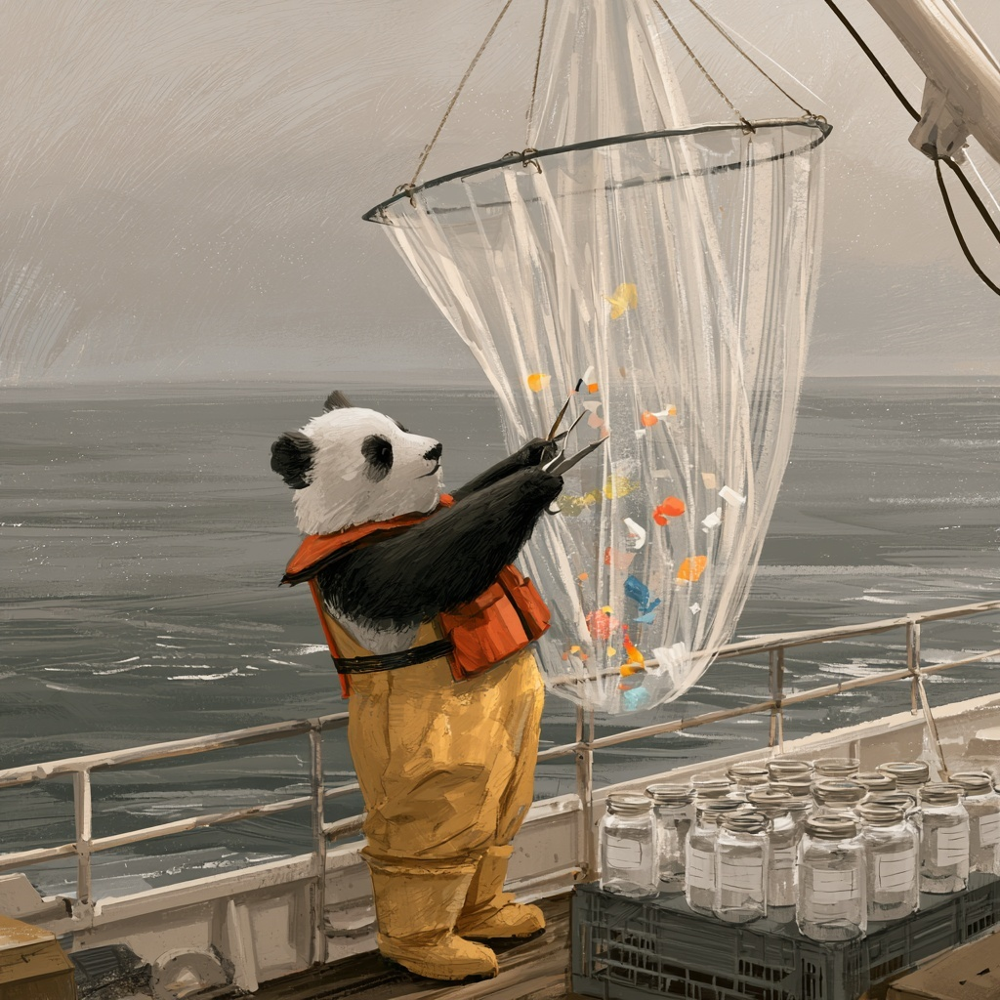

::: {style="width: 80%; margin: auto;"}

:::

:::{.gray-text .center-text}
*A panda, sorting the plastic from the plankton.* [MidJourney 5](https://www.midjourney.com/jobs/108b1a95-bb7b-4bd1-a9e5-4c99c222f9a0?index=3)

:::

NOAA's National Centers for Environmental Information maintain an archive of every marine
microplastics measurement they can find: 16,245 samples, pooled from thirty-seven
separate studies, taken between 1972 and 2022 by research vessels, citizen scientists, and
undergraduates with nets.

NOAA assembled the archive one study at a time, rather than designing it as a single experiment, so the
columns are a mixture of measurements, provenance, and somebody else's classification scheme. Most of the
environmental data you will ever be handed was put together the same way.

We have already worked with this file three times today. This afternoon you will start again from the raw
download and use it to answer one question: Is there more plastic in the Pacific than the Atlantic?

:::{.callout-note title="Reference"}
NOAA National Centers for Environmental Information, Marine Microplastics database.
[https://www.ncei.noaa.gov/products/microplastics](https://www.ncei.noaa.gov/products/microplastics)
:::

## Today's three patterns

Everything below is built from these three patterns, plus one more from this morning.

```python
df['new'] = expression                     # the derived-column pattern
df.dropna(subset=['col'])                  # the missing-data pattern, treat half
df['col'] = df['col'].fillna(value)
df['col'] = df['col'].str.strip()          # the string-cleaning pattern
```

And from this morning:

```python
df['new'] = df['col'].apply(my_function)   # your own verb, run down a column
```

## Setup

i. Create a new notebook named `EOD_Day4_Microplastics.ipynb`.

ii. Add a title cell:

```markdown
# Day 4 EOD: Microplastics, From Raw File to Real Numbers

Date: 09/03/2026
```

iii. Import what you need and read the data. The `Date` column is text, and pandas can convert
   it while it reads if you tell it exactly what the text looks like.

:::{.callout-tip title="🧭 Field Note: reading dates"}
`read_csv()` takes a `parse_dates=` argument naming the columns that hold dates, and a
`date_format=` argument describing how they are written. Here is the whole line. **Run it as
written:**

```python
df = pd.read_csv(url, parse_dates=['Date'], date_format='%m/%d/%Y %I:%M:%S %p')
```

The format string is a small language of its own. `%m/%d/%Y` is month, day, four-digit year;
`%I:%M:%S` is a twelve-hour clock; and `%p` is the AM or PM that goes with it. You are not
expected to be able to write one of these yet, so copy the line above exactly as it is and keep going.

Once a column is a real date, you reach the pieces of it through `.dt`. You will need exactly
one of these in task 13, and we are giving it to you here:

```python
samples['year'] = samples['Date'].dt.year
```

The `.year` on the end asks for the year of each date, and the month, the day and the rest of the
pieces are available in the same way. **Dates get a full session on Day 6.**

📖 [Cheatsheet: reading CSV files](../cheatsheets/read_csv.qmd) · [Cheatsheet: time series](../cheatsheets/timeseries.qmd)
:::

```{python}
#| echo: true
#| include: true

import pandas as pd
import numpy as np
import matplotlib.pyplot as plt

url = 'https://eds-217-essential-python.github.io/data/marine_microplastics.csv'
df = pd.read_csv(url, parse_dates=['Date'], date_format='%m/%d/%Y %I:%M:%S %p')
```

## Part 1: Get your bearings

Answer each of these questions in a markdown cell underneath the code that produced the answer.

1. How many rows and columns? Display the first few rows.
2. Run `.info()`. Which columns are `object`, and which of those *should* be something else?
3. Run `.isnull().sum()`. How many columns have gaps? Which are the columns, and how many gaps do they have?
4. `Oceans` is missing on 271 rows and `Measurement` on 5,792. Are those the same rows? How do you know?

```{python}
print(df.shape)
df.head()
```

```{python}
df.info()
```

```{python}
df.isnull().sum()
```

```{python}
# The 271 rows missing an ocean are all rows that are also missing a measurement:
# filtering out the missing measurements leaves nothing missing an ocean.
measured = df.dropna(subset=['Measurement'])
print(measured.shape)
print(measured['Oceans'].isnull().sum())
```

## Part 2: Decide what to keep

Part 2 requires some judgement, so more than one answer here is defensible. Several of these tasks
change how many rows you have, so **print `.shape` after each one** and record the number in
a markdown cell.

5. Use `.dropna()` with `subset=` to keep only the rows with a `Measurement`. How many
   rows are left, and what fraction of the file is that?

```{python}
df = df.dropna(subset=['Measurement'])
print(df.shape)
print(df.shape[0] / 16245)
```

6. Run `df['Unit'].value_counts()` now and compare it with the counts below, which are what the
   same line gave before task 5: `pieces/m3` 10,178, `pieces/10 mins` 5,792, `pieces kg-1 d.w.`
   275. What did that one
   line cost you, and which sampling programme did the rows you lost belong to? (Check
   `Sampling Method` and `Organization` on the rows you removed, if you want to be sure.)

```{python}
df['Unit'].value_counts()
```

7. Fill the gaps in `Regions` and `SubRegions` with `'Unspecified'`, one column at a time,
   assigning each result back. Confirm with `.isnull().sum()` that only `Keywords` is still
   missing anything.

```{python}
df['Regions'] = df['Regions'].fillna('Unspecified')
df['SubRegions'] = df['SubRegions'].fillna('Unspecified')
df.isnull().sum()
```

8. In a markdown cell: task 5 removed rows and task 7 kept them. Both were the right decision.
   Explain in two or three sentences what made them different.

9. Check for duplicated rows. Do it twice: once bare, and once with `subset=` naming the
   columns you think define a single observation. Report both numbers and say which one you
   believe.

```{python}
print(df.duplicated().sum())

sample_columns = ['Latitude', 'Longitude', 'Date', 'Measurement', 'Unit']
print(df.duplicated(subset=sample_columns).sum())
```

## Part 3: Make it comparable

10. Filter to the samples reported in `pieces/m3`, end the line with `.copy()`, and call the
    result `samples`. How many rows?

```{python}
samples = df[df['Unit'] == 'pieces/m3'].copy()
samples.shape
```

11. `Accession Number` is a label, not a quantity. Convert it to text with `.astype(str)` and
    assign it back. Confirm with `.dtype`.

```{python}
samples['Accession Number'] = samples['Accession Number'].astype(str)
samples['Accession Number'].dtype
```

12. The `Oceans` values all end in the word "Ocean". Use `.str.replace()` to make a new column
    called `ocean` holding the short name, and check it with `.value_counts()`.

```{python}
samples['ocean'] = samples['Oceans'].str.replace(' Ocean', '')
samples['ocean'].value_counts()
```

13. Add a column called `year` holding the year each sample was taken, using the supplied line
    from the setup Field Note. Then run `.value_counts()` on `year`. Which single year
    contributed the most samples? In a markdown cell, say whether the archive is spread evenly
    across its fifty-one calendar years, and what an uneven spread would mean for anyone who wants
    to use it
    to describe a trend.

```{python}
samples['year'] = samples['Date'].dt.year
samples['year'].value_counts().head(10)
```

## Part 4: The derived columns

14. Run `.describe()` on `Measurement`. Write down the median and the maximum. How many orders
    of magnitude separate them?

```{python}
samples['Measurement'].describe()
```

15. Draw a histogram of `Measurement`.

:::{.callout-tip title="🧭 Field Note: a histogram in one line"}
On Day 1 we drew a line with `plt.plot(series)`. A histogram is the same kind of call:

```python
plt.hist(samples['Measurement'])
plt.xlabel('pieces per cubic metre')
plt.show()
```

`plt.hist()` sorts the values into bins and draws a bar for each. **Plotting gets a full day
next week**, where you will learn to control bins, axes, and everything else. Today you need
it only to see the shape of the distribution.

📖 [Cheatsheet: matplotlib](../cheatsheets/matplotlib.qmd)
:::

```{python}
plt.hist(samples['Measurement'])
plt.xlabel('pieces per cubic metre')
plt.show()
```

16. The histogram you just drew is useless. State the reason why in a markdown cell.

17. Filter `samples` to the rows where `Measurement` is greater than zero, end the line with
    `.copy()`, and call it `positive`. How many samples reported exactly zero pieces? Is zero a
    measurement or a missing value?

```{python}
positive = samples[samples['Measurement'] > 0].copy()
print(positive.shape)
print(samples.shape[0] - positive.shape[0])
```

18. Add a column to `positive` called `log10_measurement` holding `np.log10()` of the
    measurement. Run `.describe()` on it, then draw the histogram again.

```{python}
positive['log10_measurement'] = np.log10(positive['Measurement'])
positive['log10_measurement'].describe()
```

```{python}
plt.hist(positive['log10_measurement'])
plt.xlabel('log10(pieces per cubic metre)')
plt.show()
```

19. In a markdown cell, describe the shape you can now see and could not see before. Name one
    thing about the data that this plot tells you and `.describe()` did not.

## Part 5: A classifier of your own

The archive has a column called `Density Class` with values like `Low` and `Very High`.
Somebody decided those cutoffs. You will write your own classifier first, and then compare your
labels against theirs.

20. Write a function called `density_class` that takes a measurement in pieces per cubic metre
    and returns:

    - `'low'` below 0.01
    - `'medium'` from 0.01 up to 1
    - `'high'` at 1 and above

    Test it on `0.001`, `0.5`, and `50` before touching the DataFrame.

```{python}
def density_class(measurement):
    """Label a microplastic concentration in pieces/m3."""
    if measurement < 0.01:
        return 'low'
    elif measurement < 1:
        return 'medium'
    else:
        return 'high'


print(density_class(0.001), density_class(0.5), density_class(50))
```

21. Use `.apply()` to run your function down `positive['Measurement']`, store the result in a
    column called `my_class`, and report the counts.

```{python}
positive['my_class'] = positive['Measurement'].apply(density_class)
positive['my_class'].value_counts()
```

22. Now compare your labels with NOAA's. Filter `positive` to the rows NOAA labelled
    `'Medium'`, and run `.value_counts()` on `my_class` for just those rows. Do the same for
    NOAA's `'Very Low'`.

```{python}
noaa_medium = positive[positive['Density Class'] == 'Medium']
print(noaa_medium['my_class'].value_counts())

noaa_very_low = positive[positive['Density Class'] == 'Very Low']
print(noaa_very_low['my_class'].value_counts())
```

23. Something is wrong, and it is not your function. In a markdown cell, explain what NOAA's
    `Density Class` must actually mean, given that samples they called `Very Low` fall in your
    `high` bin. Then say whether you would use their column in an analysis, and why.

:::{.callout-tip title="A hint"}
Look at `Density Range` alongside `Density Class`. Run
`positive[['Density Class', 'Density Range']].drop_duplicates()` and read the result carefully.
:::

```{python}
positive[['Density Class', 'Density Range']].drop_duplicates().sort_values('Density Class')
```

## Part 6: The question

24. Build two tables with the filter pattern: the Atlantic samples and the Pacific samples,
    from `positive`. Report the row count of each.

```{python}
atlantic = positive[positive['ocean'] == 'Atlantic'].copy()
pacific = positive[positive['ocean'] == 'Pacific'].copy()

print(atlantic.shape)
print(pacific.shape)
```

25. Run `.describe()` on `Measurement` for each. Compare the two medians (the `50%` row), and
    then compare the two means. They will probably tell you two different stories. Which one
    would you put in a report, and why?

```{python}
print(atlantic['Measurement'].describe())
print(pacific['Measurement'].describe())
```

26. Compare the mean of `log10_measurement` for each instead. In a markdown cell, say what that
    comparison is doing that the comparison of raw means was not.

```{python}
print(atlantic['log10_measurement'].mean())
print(pacific['log10_measurement'].mean())
```

27. Before you conclude anything: how many Pacific samples are there, out of how many total?
    Task 12 counted the oceans in `samples`, before the zeros came out, so expect a different
    pair of numbers here. In one sentence, say what you would need to know about *how the
    samples were collected* before you would publish a comparison between these two oceans.

## Part 7: Write it up

In a single markdown cell of 200 to 300 words, answer this:

> A journalist emails you: "Is there more plastic in the Pacific than the Atlantic? I heard
> about the garbage patch." You have this dataset and one afternoon. What do you tell them?

Your answer must cite at least three specific numbers you computed here, must name at least
one cleaning decision you made and what it cost, and must include at least one thing this
dataset cannot tell them. Use complete sentences.

## The grammar minute

Look back through your notebook. Every code cell you wrote was one of a handful of
patterns:

```python
df.dropna(subset=['col'])                  # keep rows that have what you need
df['col'] = df['col'].fillna(value)        # or keep the row and fill the hole
df['col'] = df['col'].astype(str)          # tell pandas what a column is
df['col'] = df['col'].str.replace(a, b)    # tidy text
df['new'] = expression                     # add a column that was not in the file
df['new'] = df['col'].apply(my_function)   # add a column only you know how to compute
```

Six patterns, and every one of them is new today.

The pattern that did the most work today was `df['new'] = ...`, the derived column, which you
built four times over:
`ocean`, `year`, `log10_measurement`, and `my_class`. The twenty-two columns you downloaded did not have
an answer to the journalist's question in them, and the four columns you made yourself are where you
found one!

## Wrap-up

Before you close your notebook, check that:

- every step that removed rows has the new row count printed under it
- every cleaning decision has a markdown sentence saying **why**, not just what
- your Part 7 answer names a number that came from a column you derived
- you can say out loud what `subset=` does, and why `.duplicated()` without it returned zero
- your notebook reads top to bottom as a document, not as a pile of cells

If something here did not work and you could not work out why, ask Cella or Kelly rather than
fighting one cell to the end of the afternoon. Getting stuck on an end-of-day practice is
normal and expected!

## Resources

- [📖 EDS 217 cheatsheet: cleaning data](../cheatsheets/data_cleaning.qmd)
- [📖 EDS 217 cheatsheet: functions](../cheatsheets/functions.qmd)
- [📖 EDS 217 cheatsheet: pandas DataFrames](../cheatsheets/pandas_dataframes.qmd)
- [📖 EDS 217 cheatsheet: data selection and filtering](../cheatsheets/data_selection.qmd)
- [NOAA NCEI marine microplastics](https://www.ncei.noaa.gov/products/microplastics){target="_blank"}
