::: {style="width: 60%; margin: auto;"}

:::

Welcome to the first session of Day 1, and to your first hands-on session of the course. You
have already met **Positron** in your R course, so the workspace itself will look familiar.
This morning we will learn how Positron works with Python, and you will build your
first **Jupyter Notebook**. Notebooks are where you will write your code for the rest of this
course, and for most of your time in the MEDS program.

::: {.center-text .body-text-m}
Always remember: [**Python is the programming language. Positron is the IDE.**]{.teal-text}
:::

An *IDE* (integrated development environment) is a workspace that puts your code, its
output, your notes, and your files together in one place. Positron is the IDE we use in this class.
Python is the language we write in it.

::: {.callout-note}
Positron runs both R and Python. The panes you learned in your R course, the Console, the
Variables pane, the Plots pane, and the file Explorer, all do the same jobs when coding in
Python. The only things that change are the interpreter Positron is running (python
instead of R) and the file format we write in (.ipynb).
:::

Every step below is written for **workbench-1.bren.ucsb.edu**, which is the Bren server we
run this course on. The screenshots were taken on that server, so what you see on your own
screen should match them closely. The one difference you should expect is the username: the
screenshots say `caylor`, and yours will say your own Bren username.

## Meet Positron on Posit Workbench

We run Positron on a shared **Posit Workbench** server, so there is nothing to install.
Everything happens in your browser.

#### Step 1: Sign in to Posit Workbench

1. Open a browser and go to [workbench-1.bren.ucsb.edu](https://workbench-1.bren.ucsb.edu).
2. Enter your Bren username and password. Leave **Stay signed in when browser closes**
   unchecked, because we are on lab machines this week.
3. Click **Sign in**.

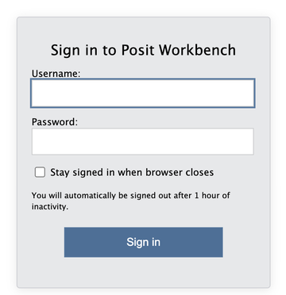

::: {.callout-note title="Workbench signs you out after an hour of inactivity"}
The notice just above the Sign in button warns you that you will be signed out for inactivity; an hour away from the keyboard really is all it takes. However, if you come back from lunch to a sign-in page, your session itself is
still running on the server. Sign in again and you should find your work right where you left it. That being said, you should always save your work when you are stepping away from your computer, just in case!
:::

#### Step 2: Look at the Projects page

Signing in brings you to the **Projects** page, which lists the sessions you already have
running. On your first visit your own list should be empty, and the screenshot below shows a
session already running only because it was taken on an account that had one from earlier in
the day.

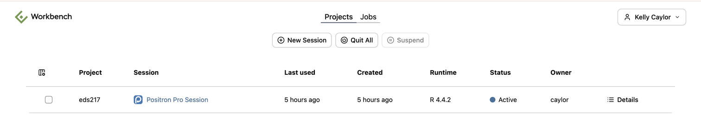

Each row gives you the project, the session name, when it was last used, when it was created,
which runtime it is using, whether it is Active or Suspended, whose account it belongs to, and
a Details link.

#### Step 3: Launch a Positron session

1. Click **+ New Session**.
2. Leave **Positron Pro** selected. Workbench also offers RStudio Pro, JupyterLab, and VS
   Code, and we will not be using any of those in this course.
3. Leave the **Session Name** as it is, or give it a name you will recognize later.
4. Leave the **Resource Profile** on **Default (1 CPU, 4GB RAM)**, which is plenty for
   everything we do this week. The Small, Medium and Large profiles are there for jobs that
   need more memory than we will ever ask for.
5. Click **Launch**.

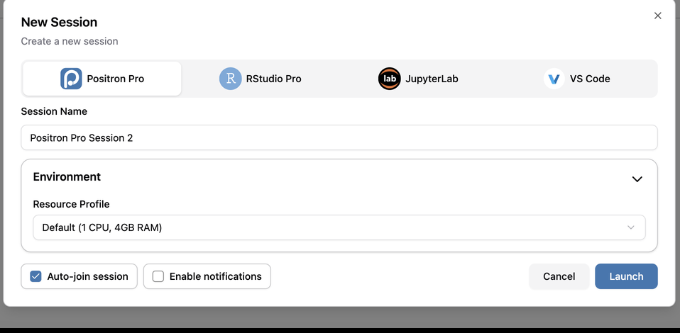

Workbench starts the session and opens Positron in the same browser tab. Starting a session
for the first time takes a few seconds, so give it a moment.

::: {.callout-tip title="Positron in Python is still Positron"}
Everything you learned about the Positron layout in your R course applies here: the
**Editor** in the middle, the **Console** below it, the **Explorer** in the left sidebar,
and the **Session** panes (Variables, Plots, Help) on the right.
:::

## Make a folder for this course

Positron works best when it has a folder open, because the Explorer, the Console working
directory, and every relative file path you write all start from that folder. So the first
thing we will do is make a new folder for EDS 217, which will keep everything for this course.

#### Step 1: Open the New Folder wizard

From the **New** menu in the top left, choose **New Folder from Template...**. (The Welcome
page offers the same wizard under the **New Folder...** icon, if that is where you happen to
be.)

#### Step 2: Choose the Empty Project template

Positron offers four templates. Python Project, R Project and Jupyter Notebook all add
scaffolding we do not need yet, so choose **Empty Project** and click **Next**.

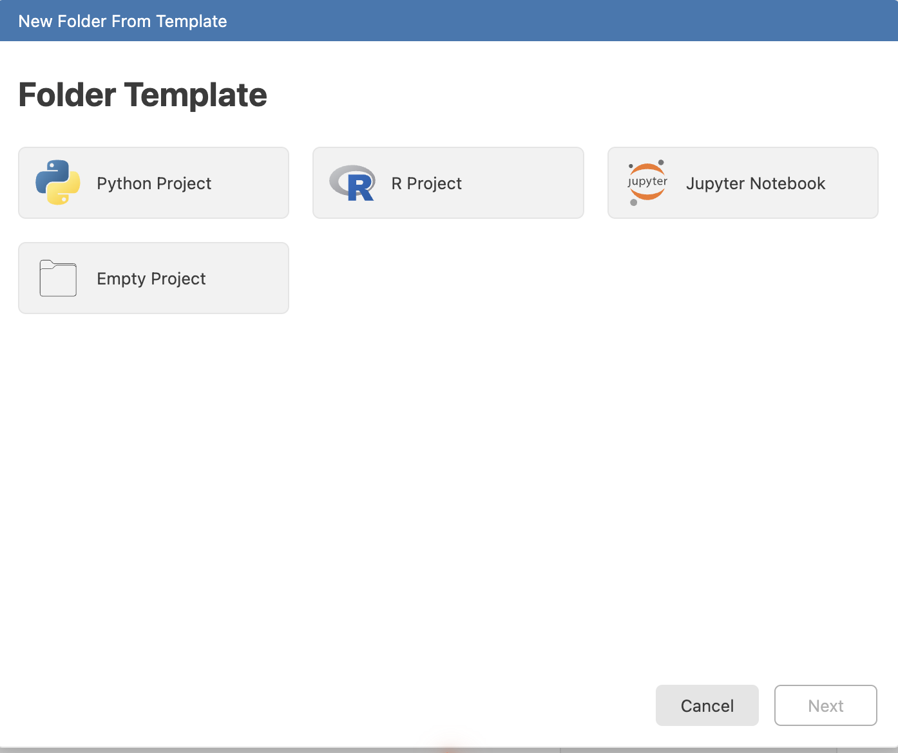

#### Step 3: Name the folder and put it in your home directory

1. Replace the suggested name with `eds217`.
2. Leave the **Location** as `/home/` followed by your username, which is your home
   directory on the server and where we want the folder to live.
3. Check the line underneath. It should read **New folder will be created at
   /home/your-username/eds217**.
4. Leave **Initialize Git repository** unchecked. We will come to git on Day 8.
5. Click **Create**.

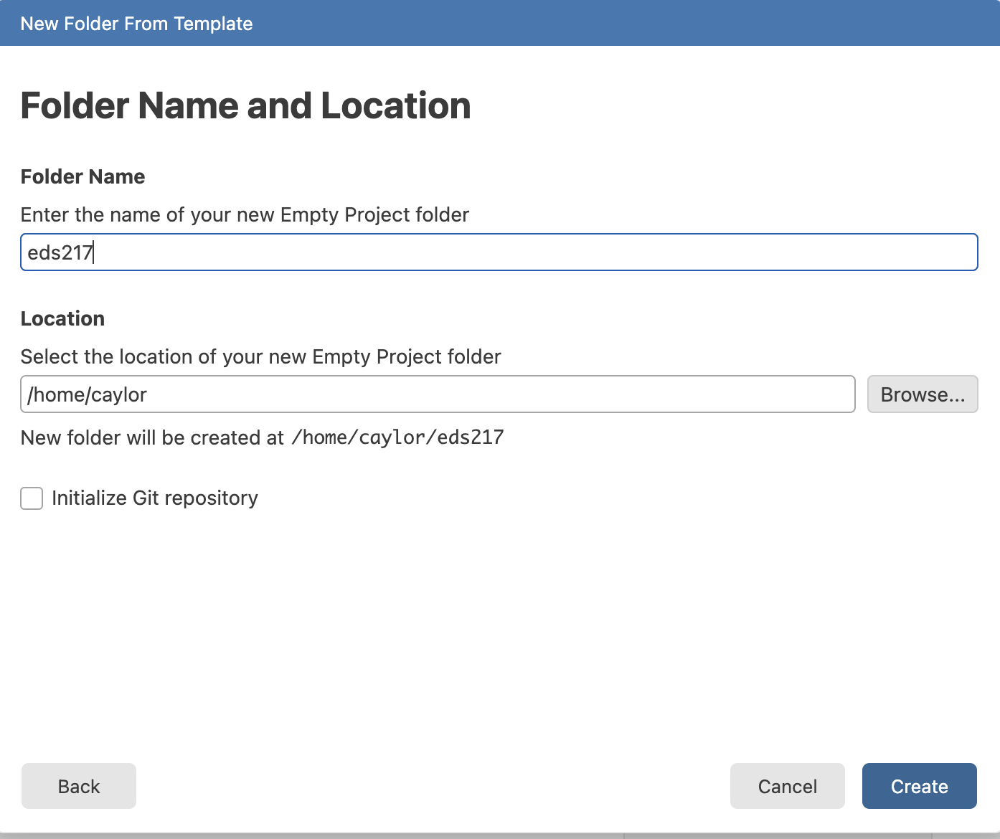

#### Step 4: Open the folder in the current window

Positron confirms the folder and asks where to open it. Click **Current Window**, so that
Positron reloads with `eds217` as its open folder. **New Window** is the blue button and the
one you do not want, because it opens a second browser tab and multiple tabs get confusing
quickly.

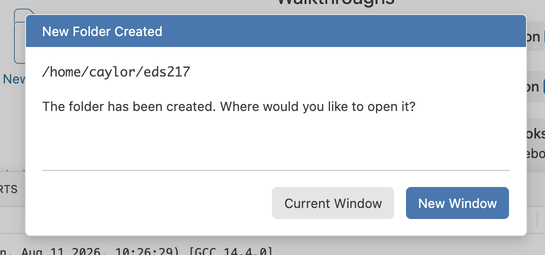

Positron reloads, and the Explorer on the left should now show an **EDS217** heading with
nothing under it yet. Everything you make this week should go in this folder.

## Point the Console at the eds217 environment

Positron opens the folder with an **R** console, because R is the first interpreter it finds
on the Bren server. The name in the top right corner will read **R 4.4.2**, and the Console 
will show you the R startup banner.

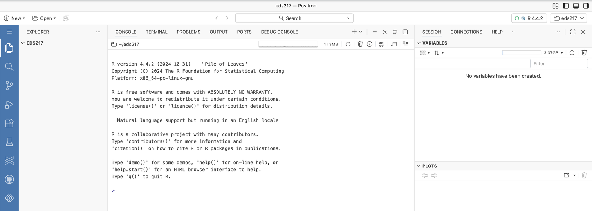

R is not the interpreter we want this morning, and switching over to Python takes three
clicks.

#### Step 1: Open the session picker

Click the interpreter name in the top right corner. Positron lists the sessions you already
have running and offers **New Console Session...** at the bottom. Click it.

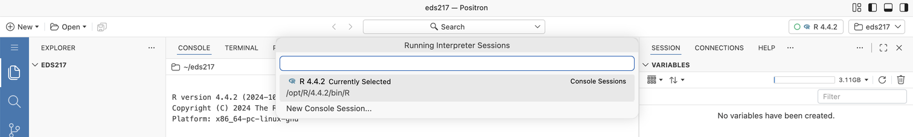

#### Step 2: Choose the eds217 environment

Positron lists every interpreter it can find on the server, and there are a lot of them. The
one we want is (hopefully!) at the top, marked **Suggested**:

> **Python 3.11.15 (Conda: eds217)**
> `/opt/miniforge3/envs/eds217/bin/python`

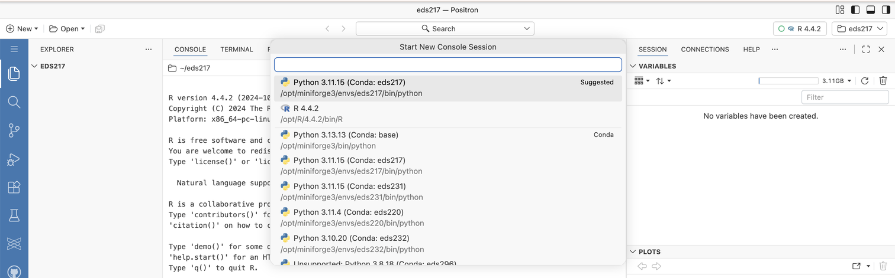

:::{.callout-caution title="Read the environment name, not just the Python version"}
The Bren server hosts the environments for several MEDS courses, and their names all look
alike: `eds220`, `eds231`, `eds232`, `eds296`. One of them, `eds231`, even runs the same
Python 3.11.15 that ours does. The one you want says **eds217**. You may need to scroll to find
this environment the first time you use it, but eventually it should show up at the top of the list.
:::

Positron starts the Python session, and the Console prompt changes from `>` to `>>>`. The
name in the top right should now read **Python 3.11.15 (Conda: eds217)**.

Both sessions are still running, listed one above the other in the column to the right of the
Console, and you can click between them at any time. Generally, for this course, it's best just
to delete the R console to avoid any accidental confusion.

## Two ways to run Python

Positron can run your Python code in two places. It is worth seeing both once so you know
the difference.

### The Console (a REPL)

The Console is a Python prompt, and a prompt of that kind is called a **REPL**, which stands
for Read-Eval-Print Loop. It is the same idea as the R console you have already used.

::: {.callout-note}
A **REPL** **R**eads what you type, **E**valuates it, **P**rints the result, and **L**oops
back for more. It is an interactive prompt for trying one line at a time.
:::

Click into the Console, type an expression, and press Enter:

```python
21 * 2
```

```
42
```

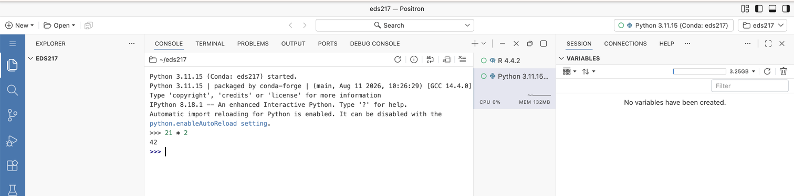

Read, evaluate, print, and then loop back around: you typed an expression, Python evaluated
it, and the Console printed `42`. We are only checking that the environment works here. We
cover Python's syntax properly in the next session this morning, and the full set of
operators on Day 3.

Notice the folder name `~/eds217` above the Console output. The Console is working inside
the folder you made, which is exactly what we wanted.

The Console is useful for quick checks, but nothing you type in it survives the session, so
anything you want to keep should go in a notebook (or a .py file) instead.

### Jupyter Notebooks (what we will use)

For the rest of this course you will write your code in **Jupyter Notebooks**, files ending
in `.ipynb`. A notebook lets you combine **code**, its **output**, and **narrative text** in
one document, so your analysis and the story of your analysis stay together. Combining them
is known as literate programming, and it is exactly what we want for data science. Notebooks
are where we will be working for the rest of the course.

## Make your first notebook

Let's make the notebook you will use for the rest of today. **We follow the same four steps
at the start of every session**, so you should have them memorized by Wednesday.

#### Step 1: Create the file

In the Explorer, hover over the **EDS217** heading. Four small icons appear. Click the first
one, whose tooltip reads **New File...**, then type the name

```
hello_world.ipynb
```

and press Enter.

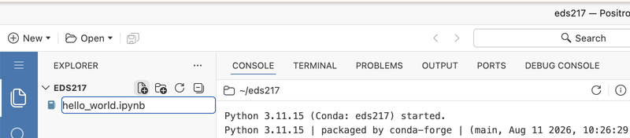

::: {.callout-tip title="Name the file first, and get the extension right"}
Naming a file at the moment you create it means you never lose work to a forgotten file
name. The `.ipynb` extension tells Positron to open the file as a notebook rather than as a
page of text, so type it out in full.
:::

Positron creates the file inside `~/eds217` and opens it as an empty notebook.

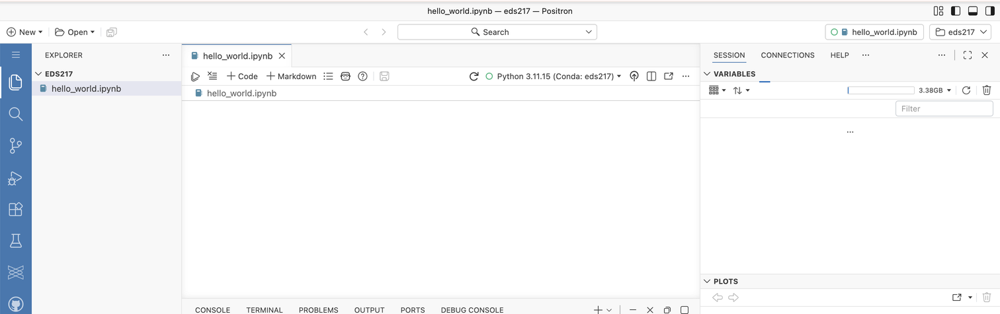

#### Step 2: Check the kernel

Look along the notebook's action bar, right of centre. It should already read **Python
3.11.15 (Conda: eds217)** with a small green ring beside it.

If it reads anything else, click it and choose **Change Kernel**. Positron opens a list titled
**Select Positron Notebook Kernel**, which holds the same interpreters you saw for the
Console. Pick the eds217 entry, and read the environment name rather than the Python version.

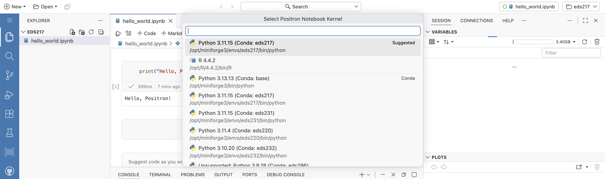

:::{.callout-note title="Interpreter and kernel are two separate settings"}
The name in the top right corner of the window controls the Console. The kernel selector in
the notebook's action bar controls this notebook. Each notebook keeps its own kernel, so you
should check it every time you open a new one.
:::

#### Step 3: Write and run a cell

Click **+ Code** in the action bar to add a code cell, type the classic first line of code,
and run it with `Shift + Enter`:

```{python}
print("Hello, Positron!")
```

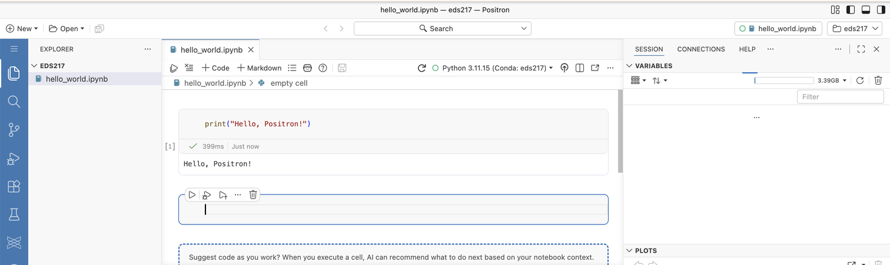

The output appears directly below the cell, along with the execution count in square
brackets and how long the cell took to run. `Shift + Enter` runs the cell and moves to the
next cell, and creates a new one if there is nothing below. `Ctrl + Enter` (`Cmd + Enter`)
runs the cell and stays put.

:::{.callout-note title="Positron will offer to write your code for you"}
The first time you run a cell, Positron asks whether it should suggest code as you work.
Choose **Not now**. Getting a machine to write your code is a skill worth having, and it is
worth having *after* you can write the code yourself, which is what these nine days are for.
:::

:::{.callout-tip title="✏️ Test your knowledge"}
Change the message inside the quotes to greet yourself by name, then re-run the cell with
`Shift + Enter`. Did the output update? Did the number in the square brackets change?
:::

#### Step 4: Add a title cell

1. Hover just above your first code cell. A **+ Code** and a **+ Markdown** button appear
   between cells wherever you hover, so click **+ Markdown** there to put a Markdown cell at
   the top of the notebook.
2. Give it the following content:

```markdown
# Day 1: Session 1A - Positron & Jupyter Notebooks

[Session Webpage](https://eds-217-essential-python.github.io/course-materials/interactive-sessions/1a_positron_notebooks.html)

Date: 08/31/2026
```

Run the Markdown cell (`Shift + Enter`) to **render** it into formatted text. Double-click a
rendered Markdown cell to edit it again.

:::{.callout-caution}
Save your work often. Click the save icon in the action bar, or press `Ctrl + S`
(`Cmd + S` on macOS).
:::

Throughout the session: take notes in Markdown cells, write and run code in Code cells, and
ask Cella or Kelly whenever something does not behave the way you expected.

## Working with cells

A notebook is a stack of **cells**. Two kinds matter to us:

- **Code cells** for writing and running Python.
- **Markdown cells** for writing formatted text (notes, headings, links).

Hover between two cells, or below the last one, and Positron offers buttons to insert a new
**Code** cell or a new **Markdown** cell at that point. Each cell also has its own small
toolbar for running, moving, and deleting it.

Try some Markdown formatting in a new cell:

```markdown
## My notes

This is a **Markdown** cell. I can write:

- **Bold** with `**text**`
- *Italic* with `*text*`
- [Links](https://positron.posit.co/)
```

:::{.callout-tip title="✏️ Test your knowledge"}
Add one more bullet to your Markdown cell, a link to the course website, then re-render it.
:::

## Handy Positron features

A few features that should save you time all week:

- **The Variables pane:** shows the names, types, and values of everything you have defined,
  and it updates as you run cells. The Variables pane is the same one you used to watch your
  R objects, and it works for notebooks and the Console alike, with no extension to install.
- **The Data Explorer:** click a DataFrame in the Variables pane to open it as a sortable,
  filterable table. You will use the Data Explorer constantly once we meet our first
  DataFrame this afternoon.
- **Tab completion:** start typing a name and press `Tab` to auto-complete it or see
  suggestions.
- **Built-in help:** type `help(print)` in a code cell to read a function's documentation,
  or add a `?` after a name (`print?`) for a quick description. Pressing `F1` with your
  cursor on a name opens the same documentation in the **Help** pane.
- **Magic commands:** IPython adds special commands prefixed with `%`, like `%whos` to list
  your variables. We will use a few of them later in the week.

:::{.callout-tip title="✏️ Test your knowledge"}
In a code cell, type `pri` and press `Tab`. Does Positron offer to complete it to `print`?
Then run `help(print)` and skim the description.
:::

:::{.callout-warning title="Limits of the Variables pane"}
The Variables pane is not the right tool for very large DataFrames or arrays. Use
`df.head()`, `df.info()`, and `df.describe()` for those. You will meet all three this
afternoon and learn them properly on Day 2.
:::

## Saving, restarting and coming back tomorrow

- **Save:** the save icon, or `Ctrl + S` / `Cmd + S`. Do this often.
- **Restart:** if your notebook stops behaving, use the restart icon in the action bar. A
  restart clears every variable, so re-run your cells from the top afterward.
- **Coming back:** your session keeps running on the server even after you close the browser.
  Go back to [workbench-1.bren.ucsb.edu](https://workbench-1.bren.ucsb.edu), sign in, and
  click your Positron session in the list to pick up where you left off.
- **Export:** Positron can render a notebook to other formats through Quarto. You will not
  need to export anything until the final project, and we will cover it then.

## Key Points/Review

- **Python is the language. Positron is the IDE** you run it in, hosted on Posit Workbench at
  [workbench-1.bren.ucsb.edu](https://workbench-1.bren.ucsb.edu), so it is all in your
  browser and there is nothing to install.
- Everything you make this week should live in **`~/eds217`**, the folder you made this
  morning.
- Positron opens a folder with an **R** console, so switching to Python is a step you should
  expect to take yourself. The environment you want is **Python 3.11.15 (Conda: eds217)**,
  and its name matters more than its version number.
- Positron runs Python in a **Console** (a read-eval-print prompt) or in **notebooks**, and
  we use notebooks because they follow a literate programming model, and because a notebook
  can be saved and the Console cannot.
- You should set the **interpreter** in the top right for the Console, and the **kernel** in
  the action bar for each notebook. Both should read **eds217**.
- A notebook combines **code cells**, their **output**, and **Markdown** narrative in one
  document.
- Run a cell with `Shift + Enter`. Use `Ctrl + Enter` to run it without moving to the next
  cell.
- Start every session with the same ritual: **create the file with its name, check the
  kernel, add a title cell, save often.**

## Resources

- [Course Cheatsheet: Positron Basics](../cheatsheets/positron.qmd) covers the Variables
  pane, magic commands, and keyboard shortcuts.
- [Course Cheatsheet: Setting up Python](../cheatsheets/setting_up_python.qmd), only if you
  want Python on your own laptop as well.
- [Course Cheatsheet: First Steps](../cheatsheets/first_steps.qmd)
- [Positron User Guide](https://positron.posit.co/) is the official documentation.
- [Jupyter Notebooks in Positron](https://positron.posit.co/jupyter-notebooks.html) covers
  the notebook editor in more detail.
- A [curated gallery of Jupyter Notebooks](https://gist.github.com/kcaylor/79d9b9304764b825e0fe365df17d09fb)
  showing textbooks, articles, and analyses written as notebooks. Worth a browse to see what
  a notebook can become.

::: {.center-text .body-text-xl .teal-text}
End interactive session 1A
:::
