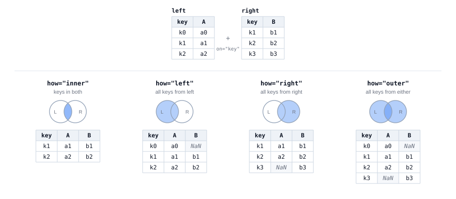
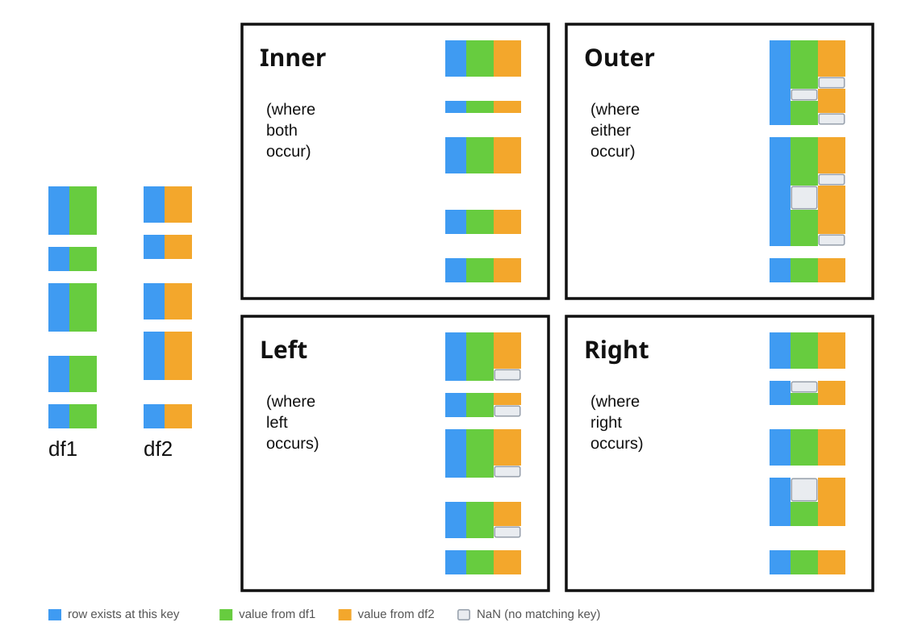

::: {style="width: 80%; margin: auto;"}

:::

:::{.gray-text .center-text}
*A panda, matching two halves along the seam.* [MidJourney 5](https://www.midjourney.com/jobs/e4667ea9-82c4-4239-a6b8-9b32e7e22005?index=3)

:::

On Friday we asked whether ozone and particulate matter follow the same daily cycle, and we
answered it the only way one table allows: we grouped ozone by hour, we grouped PM2.5 by hour,
we printed both, and we compared them by eye. Two answers, side by side on the screen, but
never side by side in the data.

Comparing by eye is fine for two columns of twenty-four numbers. It stops working the moment you
want to ask anything that needs both measurements **in the same row**: was the smoky hour also
the ozone hour? Does high PM2.5 predict high ozone three hours later? What is the correlation
between them?

To ask any of those questions, the two measurements have to sit in the same table. This morning
we will learn the pandas code patterns that allow you to join data together.

By the end of this session you will be able to:

- write the **join pattern**, `pd.merge(left, right, on='key')`, and explain what the **key** does
- choose between `how='inner'` and `how='left'`, and explain what each one does to your row count
- check a merge after you run it, and know which numbers to compare to ensure things have gone according to plan
- join two tables whose key columns have **different names**, using `left_on=` and `right_on=`
- explain why the rows a join drops are rarely a random sample of your data

## Getting Started

1. **Create the file.** In the Explorer, hover over the **EDS217** heading and click
   **New File...**, then type the name in full, extension included:
   `Session_6A_Joining_Data.ipynb`

2. **Check the kernel.** The Kernel Selector in the notebook's action bar should read
   **Python 3.11.15 (Conda: eds217)**. If it reads anything else, click it, choose
   **Change Kernel**, and pick the eds217 entry.

3. **Add a title cell.** Click **+ Markdown** in the action bar, and give it this
   content, with today's date:

```markdown
# Day 6: Session 6A - The Join Pattern

[Session Webpage](https://eds-217-essential-python.github.io/course-materials/interactive-sessions/6a_joining_data.html)

Date: 09/08/2026
```

4. **Save** with `Ctrl + S` (`Cmd + S` on macOS), and keep saving as you go.

5. Read in the Goleta air quality file, which you have now met twice:

```{python}
import pandas as pd

url = 'https://eds-217-essential-python.github.io/data/openaq_goleta_measurments.csv'
goleta = pd.read_csv(url)

goleta['parameter'].value_counts()
```

Here is our Goleta air quality file, which we now know contains three parameters and 1,962 rows. 
Every row is one measurement of one pollutant at one hour.

## Two tables out of one

Before we can join two tables we need two tables, so we will start by making them. Both lines
below are Wednesday's filter pattern, and nothing else:

```{python}
o3 = goleta[goleta['parameter'] == 'o3'].copy()
pm25 = goleta[goleta['parameter'] == 'pm25'].copy()

print(o3.shape)
print(pm25.shape)
```

Now we have 711 hours of ozone and 734 hours of PM2.5. The two instruments did not record the same number of
hours, which is important! A gap like that usually says something about how the data was (or was not) collected.

Each new table has fifteen columns, and twelve of them hold the same value in every row. Keep only the two
columns that matter, and give the measurement column a name that says what it is. One method per line,
the way we learned last Thursday:

```{python}
o3 = o3[['datetimeLocal', 'value']]
o3 = o3.rename(columns={'value': 'o3_ppm'})

pm25 = pm25[['datetimeLocal', 'value']]
pm25 = pm25.rename(columns={'value': 'pm25_ugm3'})

o3.head()
```

:::{.callout-note}
🐍 Renaming before a join is not just cosmetic. If both tables arrive at the join with a column called
`value`, pandas cannot keep them both under that name, so it renames them `value_x` and
`value_y` and leaves you to work out which is which. Naming your columns first costs you two
lines now, but saves a lot of headache later...
:::

## The join pattern

We have two tables (DataFrames) with one column in common: `datetimeLocal`, the hour the reading was taken. This shared
column is the **key**, and a merge (or join) is the operation that lines the two tables up by it.


The way we "join" these two DataFrames is using the `pd.merge()` function. 


:::{.callout-note}
🐍 Are we joining or merging?

We use `pd.merge()` as the general-purpose command for combining two
datasets on a shared key. The name comes from the statistical
computing tradition: base R has a `merge()` function, and SAS uses
`MERGE` in its data steps, so `merge` was the familiar verb for the
audience pandas was written for. There is also a `DataFrame.join()`
method in pandas, which combines two datasets on their _index_ and
which is now essentially a convenience wrapper around the same
machinery as `merge` (we've seen that happen before in things like `.value_counts()`). 
But while the name follows R and SAS, the semantics follow SQL: the `how=` argument
takes `inner`, `outer`, `left`, and `right`, which are the SQL join types. 
So the command we use to join datasets is itself a merged version of syntax from
different languages... 🤖 🤯 Computers 🤯 🤖!!

:::

## Merging as an application of set theory:

::: {style="width: 95%; margin: auto;"}

:::

:::{.gray-text .center-text}
*The same two tables, joined four ways.*
:::

The `left` table has the keys k0, k1 and k2, plus a column `A`. The `right` table has k1, k2 and
k3, plus a column `B`. The two tables agree in the middle and disagree at each end, which is the
situation most real joins are in. Each panel shades the part of the two key sets that one `how=`
keeps, and prints the table we get back.

Read the four results against each other. `inner` returns two rows and drops k0 and k3, because
neither of those keys is in both tables. `left` returns three rows: every key from the left table,
with `NaN` in column `B` at k0, where the right table has no matching row. `right` is the mirror
of it, with `NaN` in column `A` at k3. `outer` returns all four keys and fills in `NaN` on both
sides. The same two tables give us two, three, three and four rows, and the only thing we changed
between the four panels is the value of `how=`!

## Practical merging of DataFrames:

::: {style="width: 95%; margin: auto;"}

:::

:::{.gray-text .center-text}
*The same four joins, on tables long enough to have gaps in them.*
:::

A three-row table keeps the arithmetic easy to follow, but the files we merge in practice are
longer than that and their keys line up much less tidily. In the second figure, `df1` and `df2`
are drawn against a shared key axis running down the page, so every row sits at the position of
its own key, and a missing key shows up as a gap in the column rather than as a number you would
have to go and count. Neither table covers the whole axis, and the stretches they are missing are
not the same stretches.

The colours show where each part of a row came from: blue marks a key that is present in the
result, green a value taken from `df1`, orange a value taken from `df2`, and a pale outlined box
a `NaN`, where the key matched on one side only. `inner` keeps only the keys that both tables
cover, so its column is the shortest one in the figure. `outer` keeps every key that either table
covers, so its column is the longest, and the price of those extra rows is a gap wherever only one
of the two tables had a value. `left` and `right` each keep one table's keys intact and fill in
from the other table wherever a key matches.

Compare the two figures before you go on. The first figure tells us what each `how=` keeps, and
the second tells us what each one costs in rows and in `NaN` values, which is worth checking on
your own data before you trust a merged table.


```{python}
paired = pd.merge(o3, pm25, on='datetimeLocal')

paired.head()
```

Read it left to right as three instructions:

```python
pd.merge(left, right, on='key')
#        ↑     ↑         ↑
#        the two tables  the column they have in common
```

- the **first two arguments** are the tables, in order. The first is the *left* table and the
  second is the *right* one, and those two labels decide which rows survive when the two tables
  do not line up exactly.
- `on=` names the column that both tables share. Pandas looks up every value of the left table's
  key in the right table's key, and glues the matching rows together end to end.

The result has one row for every hour that appears in **both** tables, and the columns of both.
For the first time in this course, one row of your data holds two different measurements!

```{python}
paired.shape
```

## The first question to ask a merge

We now have 704 rows. We started with 711 hours of ozone and 734 hours of PM2.5.

**Where did the other rows go?**

You will want to ask that question every single time you merge two tables, because nothing in pandas checks the
row count for you. A merge that discards a third of your data looks exactly like a merge that discards nothing.

By default, `pd.merge()` keeps only the rows whose key appears in **both** tables. The default
has a name, and you should write it out:

```{python}
inner = pd.merge(o3, pm25, on='datetimeLocal', how='inner')

inner.shape
```

Same 704 rows: `how='inner'` is the merge we already ran, written out in full.

:::{.callout-note}
🐍 An **inner** join keeps the intersection of the two key sets. If you have seen a Venn diagram,
this is the lens in the middle:


Circle A is the hours ozone was recorded, circle B is the hours PM2.5 was recorded, and an inner
join keeps the shaded part.
:::

## Keeping everything on one side

Very often you do not want the intersection. You have a table you care about, and a second table
of extra information you would like to attach **where it exists**, without losing rows where it
does not.

`how='left'` does exactly that: keep every row of the left table, attach the right table where
the key matches, and fill in nulls where it does not.

```{python}
left = pd.merge(o3, pm25, on='datetimeLocal', how='left')

left.shape
```

All 711 ozone hours survive. Seven of them have no PM2.5 reading to attach, and we find those
seven with the help of our good friend `isnull()`:

```{python}
left.isnull().sum()
```

`how='right'` does the mirror image, keeping every row of the right table:

```{python}
right = pd.merge(o3, pm25, on='datetimeLocal', how='right')

print(right.shape)
print(right.isnull().sum())
```

And `how='outer'` keeps everything from both sides, filling nulls in both directions:

```{python}
outer = pd.merge(o3, pm25, on='datetimeLocal', how='outer')

print(outer.shape)
print(outer.isnull().sum())
```

| `how=` | Keeps | Rows here |
|---|---|---|
| `'inner'` (default) | keys in **both** tables | 704 |
| `'left'` | every row of the **left** table | 711 |
| `'right'` | every row of the **right** table | 734 |
| `'outer'` | every row of **either** table | 741 |
: {.hover .bordered}

Four different row counts, out of the same two tables. Which one is correct depends entirely on
the question you are asking, and choosing that question is your job rather than the software's.

:::{.callout-tip title="✏️ Test your knowledge"}
Build a third table, `pm10`, the same way you built the other two tables: filter `goleta` to
`parameter == 'pm10'`, keep `datetimeLocal` and `value`, and rename `value` to `pm10_ugm3`. Then
merge your PM2.5 table with it two ways, keeping `pm25` on the left both times, once using
`how='inner'` and once using `how='left'`, and print both shapes. How many PM2.5 hours have no
PM10 reading beside them?
:::

## The rows you lose are not a random sample

The inner join threw away 30 PM2.5 hours and 7 ozone hours, and it is tempting to shrug at 37
rows out of 1,445 and move on.

Please don't! Look at **which** rows went missing before you decide they do not matter.

On Friday we handed you a line that pulls the hour out of a timestamp. Here it is again, doing
the same job on the rows the join could not match:

```{python}
missing_o3 = right[right['o3_ppm'].isnull()].copy()

missing_o3['datetimeLocal'].str[11:13].value_counts()
```

Every single one of the thirty PM2.5 hours with no ozone beside it is at **03:00**. Not spread
across the day: all of them, all thirty, at three in the morning, on thirty different days.

```{python}
o3['datetimeLocal'].str[11:13].value_counts().sort_index()
```

The ozone table shows the same thing directly. Twenty-three hours of the day have thirty or
thirty-one readings, and hour `'03'` does not appear at all. The Goleta ozone analyser looks like
it goes offline for an hour every night, quite possibly to run a calibration, and nothing in the
file says so.

The merge surfaced that gap for us. A missing key cannot match anything, so the unmatched rows
collect exactly the hours one instrument never recorded.

:::{.callout-important title="This is the habit"}
A join is one of the best data quality instruments you have. Whenever you merge two tables, look
at the rows that did **not** match, and ask whether they have anything in common. If they do, you
have learned something about how your data was collected, and it is often something nobody
bothered to write down.
:::

:::{.callout-tip title="✏️ Test your knowledge"}
Do the mirror version. Pull the seven ozone hours that have no PM2.5 beside them out of `left`,
and look at what hours they fall on. Then, in a markdown cell, say in two or three sentences
whether this second gap tells a different story from the 3 a.m. one, and why. Does it look like a
schedule, or does it look like an accident?
:::

## What a joined table is for

Now that the two pollutants are in the same row, we can ask the question one table could not
answer. On Friday we found that ozone peaks in the early afternoon and PM2.5 peaks around
midday, from which it is tempting to conclude that the bad hours are the same hours.

Test it. The top-N pattern from Wednesday, applied to the joined table:

```{python}
paired.sort_values('pm25_ugm3', ascending=False).head(10)
```

Read the timestamps and the ozone column together. The ten smokiest hours of the month are not
one group but two. Four of them are at **01:00**, and three of those four sit in the bottom half
of the month's ozone readings, one of them in the bottom six percent. The other six hours are
daylight hours, and four of those six are in the top two percent of the month's ozone
readings.

Now average the ten together, and compare that average with the file as a whole:

```{python}
print(paired['o3_ppm'].mean())
print(paired.sort_values('pm25_ugm3', ascending=False).head(10)['o3_ppm'].mean())
```

The mean of the ten smokiest hours is **higher** than the mean of every hour, 0.029 ppm against
0.022. Read on its own, that number says the smoky hours are also the ozone hours, which is the
conclusion the row by row table just argued against. A single average cannot show the split at
all, because it is the mean of four low readings and six high ones taken together.

The individual rows give the reading that makes physical sense. Ozone is manufactured by sunlight
and cannot be produced at one in the morning, so whatever is putting particulates into Goleta's
air at 1 a.m. is a different process from the one that fouls its afternoons. A mean computed
across two processes describes neither one of them well.

Two tables of hourly averages, however carefully we compare them, cannot show us that split,
because the comparison we need is between two measurements taken in the same hour. A joined table
puts those two measurements in the same row.

## When the key columns have different names

The join pattern so far assumes both tables call the key by the same name. Real files rarely line
up that neatly, so pandas lets you name the two key columns separately: *this column here, that
column there*.

Here is a case you have already met. On Friday we grouped the national parks visitor records by
`region` and got a handful of two-letter codes back, with no idea what they meant. Count the
codes in the output below, because you will want the number in a moment:

```{python}
url = 'https://eds-217-essential-python.github.io/data/national_parks.csv'
parks = pd.read_csv(url)

parks = parks[parks['year'] != 'Total'].copy()

parks['region'].value_counts()
```

Eight codes. Note that this table is not quite Friday's: Friday's also kept only the rows whose
`unit_type` is `National Park`, and the file you have just read in keeps every unit, so it has one
code in it that Friday's did not.

Codes like these are extremely common, because whoever built the file was saving space and
already knew what they meant. The fix is a **lookup table**: a small table, often one you write
yourself, that translates codes into something a reader can use.

Here is one for the seven geographic regions, which are the ones you met on Friday:

```{python}
regions = pd.DataFrame({
    'code': ['AK', 'IM', 'MW', 'NC', 'NE', 'PW', 'SE'],
    'region_name': ['Alaska', 'Intermountain', 'Midwest', 'National Capital',
                    'Northeast', 'Pacific West', 'Southeast'],
})

regions
```

Seven rows and two columns, typed by hand, and it is about to make 21,000 rows readable. The key
is `region` on the left and `code` on the right, so you name both:

```{python}
labelled = pd.merge(parks, regions, left_on='region', right_on='code')

labelled[['unit_name', 'region', 'region_name', 'year', 'visitors']].head()
```

```python
pd.merge(left, right, left_on='column_in_left', right_on='column_in_right')
```

Naming the two columns separately is the whole difference. `on=` is the shorthand for the case
where the two names happen to agree.

:::{.callout-note}
🐍 The result has **both** key columns, `region` and `code`, holding identical values. Keeping both
is not a bug: pandas has no way to choose between them, so it returns both and leaves the choice
to you. Drop one whenever it bothers you.
:::

## The merge that quietly lost something

Check the row count, the way we now do after every merge:

```{python}
print(parks.shape)
print(labelled.shape)
```

21,174 rows went in and 21,098 came out. Seventy-six rows did not survive, because the default is
an inner join and their region code is missing from your lookup table.

Find them the way you found the 3 a.m. gap:

```{python}
checked = pd.merge(parks, regions, left_on='region', right_on='code', how='left')

missing = checked[checked['region_name'].isnull()]

print(missing['region'].value_counts())
print(missing['unit_name'].unique())
```

`NT`, seventy-six rows, all of them the Blue Ridge Parkway. Your lookup table has seven codes and
the file has eight, because the Parkway is administered as a National Trail rather than by one of
the seven geographic regions.

No error appeared and no warning printed. The inner join returned a perfectly reasonable-looking
table with a real American landmark missing from it, and we only know about it because we
compared two row counts.

:::{.callout-tip title="✏️ Test your knowledge"}
Add a row to `regions` for the `NT` code with a `region_name` of your choosing, rebuild the merge,
and confirm that all 21,174 rows now survive. Then write one sentence saying which `how=` you
would use in a script that runs every month on a file somebody else maintains, and why.
:::

## Key points

- The **join pattern** is `pd.merge(left, right, on='key')`. The key is the column the two tables
  have in common, and its values are what pandas matches the rows on.
- Use `left_on=` and `right_on=` when the key columns have **different names** in the two tables.
- `how=` decides which rows survive: `'inner'` keeps keys present in both (the default),
  `'left'` keeps every row of the left table, `'right'` the mirror, and `'outer'` keeps everything.
- **Always compare the row count before and after a merge.** No error appears and no warning
  prints when a join throws data away.
- **Always run `.isnull().sum()` after a left, right or outer join.** Those three joins exist in
  order to produce nulls, and counting the nulls tells you how many rows found no match.
- The rows a join fails to match are usually not random. Look at them, because they often tell you
  something about how the data was collected.
- Rename your measurement columns **before** you merge, so you never have to work out what
  `value_x` was.
- A **lookup table** you write yourself is a legitimate second table, and often the most useful one
  you have (all seven rows of it!).

## Resources

- [📖 EDS 217 cheatsheet: merging and joining data](../cheatsheets/data_merging.qmd)
- [📖 EDS 217 cheatsheet: pandas DataFrames](../cheatsheets/pandas_dataframes.qmd)
- [📖 EDS 217 cheatsheet: data selection and filtering](../cheatsheets/data_selection.qmd)
- [pandas documentation: `pandas.merge`](https://pandas.pydata.org/docs/reference/api/pandas.merge.html){target="_blank"}
- [pandas user guide: merge, join, concatenate](https://pandas.pydata.org/docs/user_guide/merging.html){target="_blank"}
- [OpenAQ](https://openaq.org){target="_blank"}
