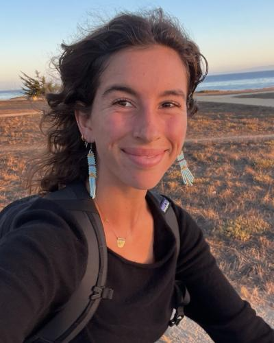

{width=70% fig-align="center" alt="import antigravity"}

::: {.gray-text .center-text}
*Cartoon by [XKCD](https://xkcd.com)*
:::

## Course Description

Almost every question you will ask of environmental data in this program needs
code to answer it. Over nine days we build that code from nothing: writing
Python, loading a dataset, reshaping the data into the form a question needs, and
drawing the answer.

EDS 217 comes first in the MEDS program, and the courses that follow assume the
Python we cover here. We work on real environmental datasets, in the tools
environmental data scientists use, following the same
[data science workflow](course-materials/the-data-science-workflow.qmd) on every
day of the course. By the end of the nine days you should be able to:

- Read environmental data into a pandas DataFrame and inspect its structure and contents

- Filter, sort, clean and transform a table to answer a question

- Group rows and aggregate them into the comparison a question needs

- Combine two tables, reshape between long and wide, and handle dates as objects

- Build a figure in matplotlib or seaborn that demonstrates a pattern or relationship in data

- Write your own Python: variables, collections, conditionals, loops and functions

- Keep a Jupyter notebook in which every conclusion is matched to the cell that produced it

- Work with a partner on a short piece of analysis, and present the result to the class

## When we meet

**Dates.** Monday August 31 to Friday September 11, 2026. We do not meet on Monday September 7.

**Hours.** 10:00 am to 4:30 pm PT, Monday to Friday. We do everything in those hours, and you
should not expect work outside them.

**Questions.** Ask in the MEDS Slack `#eds-217-python` channel rather than by email, because
others usually have the same question.

**Syllabus.** The formal course policies are in
[the syllabus](https://docs.google.com/document/d/1yBKyJFT22bKynDn4TzrNwdeZ6lb9NELqCeewhifcugo/edit?usp=sharing),
which opens in Google Docs.

**The workflow.** Every day follows the same
[ten-step data science workflow](course-materials/the-data-science-workflow.qmd), on a page that
also says where in the nine days you learn each step. Worth reading once before Day 1.

Start with [Day 1](course-materials/day1.qmd).

## Syncing your classwork to GitHub

Your daily notebooks belong in a GitHub repository that you create yourself, in
your own time rather than in class. Follow the
[directions for creating it](/course-materials/interactive-sessions/8a_github.qmd)
before Friday of the second week.

The final project goes in a second repository, separate from your coursework.
Day 9 covers what belongs in it, and the settings that differ.

## Teaching Team

 

::: {.grid}
::: {.g-col-12 .g-col-md-4}

::: {.center-text .body-text-l}
**Instructor**
:::

{width=45% fig-align="center"}

::: {.center-text}
[**Kelly Caylor**]{.teal-text}  
**Email:** [caylor@ucsb.edu](mailto:caylor@ucsb.edu)  
**Learn more:** [Bren profile](https://bren.ucsb.edu/people/kelly-caylor)  
:::

:::

::: {.g-col-12 .g-col-md-4}

::: {.center-text .body-text-l}
**TA**
:::

{width=45% fig-align="center"}

::: {.center-text}
[**Cella Schnabel**]{.teal-text}  
**Email:** [cellaschnabel@ucsb.edu](mailto:cellaschnabel@ucsb.edu)   
**Learn more:** [emLab profile](https://emlab.ucsb.edu/about/our-team/cella-schnabel)
:::

:::
:::

